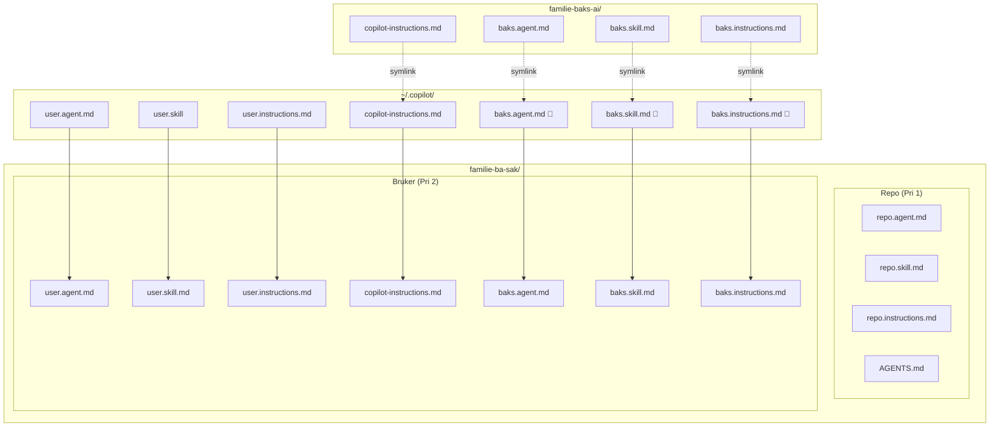

# familie-baks-ai

Samlerepo for felles AI-konfigurasjon i Team BAKS.

## Konsept

Per nå så kan AI-config kun settes på repo-nivå eller personlig nivå. 
For å unngå unødvendig duplisering og vedlikehold putter vi all felles konfigurasjon her.
Dette blir løst med litt triksing med symlinking og scripting. 
I praksis så "putter" vi alle relevante filer i dette repo inn i  `~/.copilot/`-mappen.
Se diagram nederst for mer oversikt.

Personlige filer i `~/.copilot/` blir aldri overskrevet, med unntak av `copilot-instruction.md` (inntil videre).
Konfigurasjon på repo-nivå vil alltid ha prioritet over personlige konfigurasjon.

## Navnekonvensjon

All konfigurasjon i dette repoet skal ha prefiks `baks-`.
Prefikset gjør det tydelig hva som kommer fra teamet vs. deg selv, og er det setup.sh bruker for å rydde opp.

## Hva setup.sh gjør
1. Sletter alle eksisterende `baks-*`-filer fra `~/.copilot` i undermapper `agents`, `skills` og `instructions`. 
Dette sikrer at filer som er fjernet fra repoet ikke blir hengende igjen.
2. Oppretter symlinker fra `~/.copilot/` til filene i dette repoet.

Scriptet er idempotent.

## TODO
- Opprett alias for å synke nye endringer og rekjøre setup.
- Støtte for at bruker kan ha sin egen copilot-instructions.md sidestilt med teamets.
- Støtte for OpenCode. Sjekk nav-pilot sin konvertering.

## Diagram

