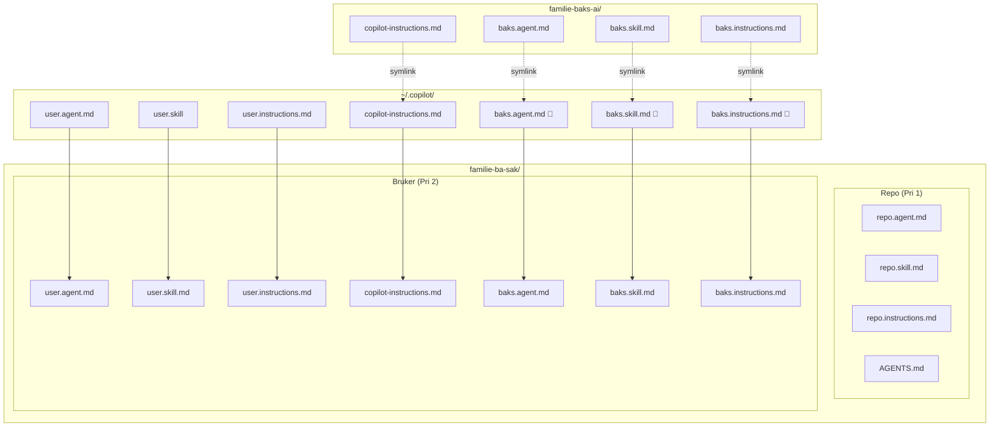
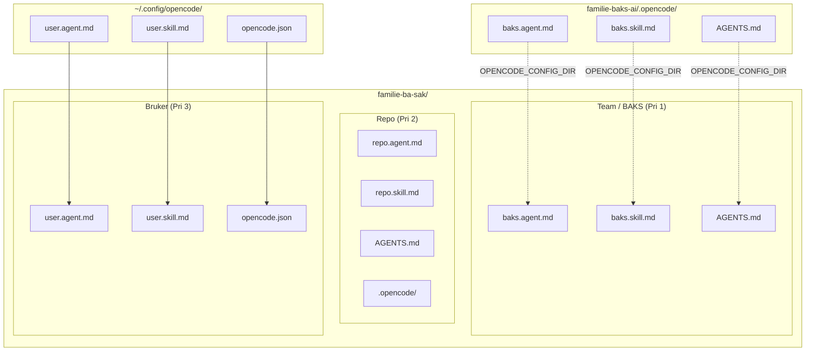

# Copilot vs. OpenCode — konfigurasjon og forskjeller

Oversikt over hvordan Copilot CLI og OpenCode laster konfigurasjon, hva som skjer når du jobber i et annet repo (f.eks. `familie-ba-sak`), og de viktigste funksjonelle forskjellene.

## Konfigurasjonsprioritering

Begge verktøyene laster konfigurasjon fra flere steder, men med **motsatt prioritet** for globalt vs. prosjekt.

### Copilot — prosjekt har høyest prioritet

Instruksjoner leses i denne rekkefølgen (sist vinner):

1. `~/.copilot/copilot-instructions.md` — global (symlinket fra dette repoet)
2. `~/.copilot/instructions/**/*.instructions.md` — global (symlinket)
3. `.github/copilot-instructions.md` — prosjekt
4. `.github/instructions/**/*.instructions.md` — prosjekt

**Prosjektets `.github/`-konfigurasjon overstyrer alltid det globale.**

### OpenCode — team-config har høyest prioritet

Konfigurasjon leses i denne rekkefølgen (sist vinner):

1. `~/.config/opencode/opencode.json` — global brukerconfig
2. `opencode.json` i prosjektet — prosjektconfig
3. `.opencode/` i prosjektet — agenter, skills, kommandoer
4. `OPENCODE_CONFIG_DIR` (peker på dette repoet) — **overstyrer prosjektet**

**Team-konfigurasjonen fra dette repoet har høyere prioritet enn prosjektets `.opencode/`.**

Dette er den viktigste forskjellen: i Copilot er det prosjektet som vinner; i OpenCode er det team-configen.
Vi burde derfor tilstrebe å ha et oppsett som gir minst mulig konflikt mellom repo og team-config.

---

## Hvordan dette repoet lastes inn

### Copilot — via symlinker (`setup-copilot.sh`)

`setup-copilot.sh` symlinker filer fra dette repoet inn i `~/.copilot/`. Når du åpner Copilot i et annet repo leses deretter prosjektets `.github/` på toppen.



### OpenCode — via `OPENCODE_CONFIG_DIR`

Sett én gang i `~/.zshrc`. OpenCode laster mappen direkte — ingen symlinker, ingen setup-script.

```bash
export OPENCODE_CONFIG_DIR=/path/til/familie-baks-ai/.opencode
```



---

## Funksjonelle forskjeller

| Funksjon                     | Copilot                                | OpenCode                         |
|------------------------------|----------------------------------------|----------------------------------|
| Instructions                 | ✅ Flere filer med `applyTo`-filtrering | ❌ Én `AGENTS.md` — alltid global |
| Skills                       | ✅                                      | ✅                                |
| Agents                       | ✅                                      | ✅                                |
| `/command`                   | ❌                                      | ✅ `.opencode/commands/`          |
| Plugins                      | ❌                                      | ✅ `.opencode/plugins/`           |
| Oppsett for delt team-config | Symlinker via `setup-copilot.sh`       | `OPENCODE_CONFIG_DIR` i `.zshrc` |
| Team-config vs. prosjekt     | Prosjekt vinner                        | Team-config vinner               |

Under er en oversikt over de mest merkbare forskjellene på syntaks på capability-type. 
Det er mange fler, men blir for mye å liste opp.

### Agents

| Felt          | Copilot                                       | OpenCode                                            |
|---------------|-----------------------------------------------|-----------------------------------------------------|
| `model`       | Leservennlig navn (`Claude Sonnet 4.5`)       | `provider/model-id` (`anthropic/claude-sonnet-4-5`) |
| `tools`       | Liste med aliaser (`read`, `edit`, `execute`) | Se `permissions`                                    |
| `permissions` | Se `tools`                                    | `allow`/`ask`/`deny` per verktøygruppe              |


### Skills

Formatet er tilnærmet identisk. En skill-fil med kun `name` og `description` fungerer i begge.

### Instructions

Copilot støtter instruksjonsfiler som aktiveres for bestemte filer via `applyTo`:

```markdown
---
applyTo: "**/*.kt"
---
Bruk alltid Kotlin-konvensjoner...
```

OpenCode har ingen tilsvarende mekanisme — `AGENTS.md` lastes alltid i sin helhet, som fjerner muligheten for granularitet.

### Commands

OpenCode støtter egendefinerte prompts som kan kjøres med `/`-prefiks i TUI. F.eks `/test`:

```markdown
---
description: Kjør tester og forklar feil
---
Kjør testene og forklar eventuelle feil i klartekst.
```

Copilot har ikke tilsvarende støtte. Den har `/prompt`, men kan kun defineres i repo, ikke globalt.
